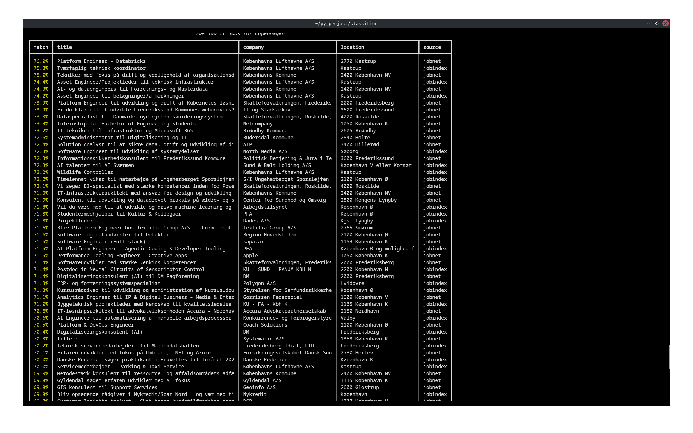
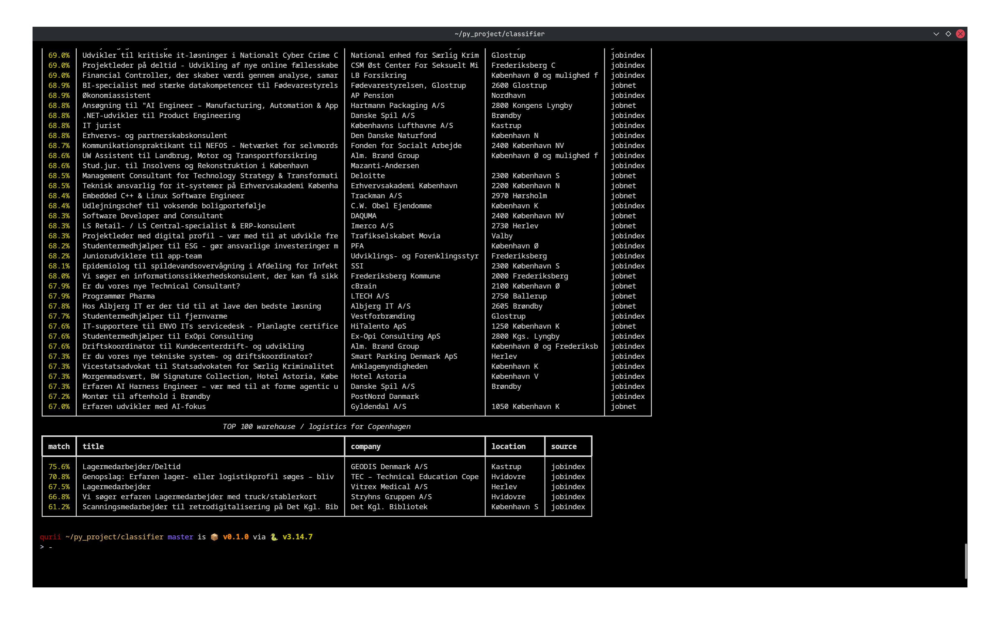

<div align="center">


# Job classifier search
</div>


Collects job ads from jobnet.dk and jobindex.dk, filters them against a
candidate profile, ranks them with the Laya decision model, prints two tables
(IT, warehouse/logistics) and writes the same result to `jobs.md`.


## Example of work

| Ranked IT jobs | Warehouse / logistics |
| --- | --- |
|  |  |

## Run

Python 3.13 and `uv`. Commands are run from the project root: `profile.yaml`,
`.cache`, `labels.csv` and `jobs.md` are resolved relative to the working
directory.

```
uv sync
uv run python src/jobfit.py
```

The first run downloads the Laya multilingual checkpoint and fetches every job
page, about four minutes. Later runs use the cache and take seconds.

## Pipeline

1. Sources. `sources/jobnet.py` calls the Jobnet search API, `sources/jobindex.py`
   calls the Jobindex search API. Pages are fetched in parallel and cached.
2. Enrichment. `sources/enrich.py` opens each Jobindex ad page: internal ads give
   the full text, external ones only a teaser. Jobnet returns full descriptions.
3. Normalization. Both sources map to one dict: title, company, location, url,
   description, deadline, address, coordinates, source. Duplicates are dropped
   by title and company.
4. Filters. A keyword gate keeps ads that mention a profile skill or role.
   `blacklist_companies`, `blacklist_title_keywords` and
   `blacklist_description_patterns` from `profile.yaml` remove the rest.
5. Scoring. Laya answers nine typed questions per ad: job family, seniority,
   skill overlap, role fit, English/Danish, Copenhagen, spam, sponsorship. Raw
   answers are cached, so percents can be recomputed without the model.
6. Output. `compute_final_percent` combines the answers by weight. Rich prints
   the tables, `jobs.md` keeps the same rows with clickable titles.

## Profile

`profile.yaml` holds roles, skills, languages, seniority, salary floor and the
blacklists. Editing it invalidates the score cache: the profile text is part of
the model input.

```yaml
location_preference: Copenhagen
remote_allowed: true
hybrid_allowed: true

roles:
  # IT & Software
  - Backend Engineer
  - Data Engineer

skills:
  strong: 
    - Python
  good: 
    - TypeScript
  learning: 
    - Danish

languages:
  English: fluent
  Ukrainian: native
  Russian: fluent
  Danish: basic

work_authorization:
  needs_sponsorship: false

salary_min_dkk_month: 15000
seniority: junior
preferred_seniority: 
  - student


blacklist_companies:
  - "Politiets Efterretningstjeneste"


blacklist_title_keywords:
  - "senior"
  - "lead"

blacklist_description_patterns:
  - "sikkerhedsgodkendelse"
```


## Calibration

Out of the box Laya is over-confident, so percents rank poorly. Fix it on your
own data:

1. `uv run python src/label.py` exports the top 200 ads to `labels.csv`.
2. Fill `human_skill_overlap` (0-4), `human_role_fit` (0-4), `human_spam`
   (0 or 1). Minimum 20 rows per question, 100+ is better.
3. `uv run python src/calibrate.py` fits a power scaling `k` per question by
   minimizing negative log-likelihood and writes `calibration.json`.
4. `uv run python src/jobfit.py` applies it. This step is instant: answers come
   from the cache, the model is not loaded.

## Cache

- `.cache/*.json` source list responses, TTL 1 hour
- `.cache/*.html` Jobindex ad pages, TTL 7 days
- `.cache/scores.json` model answers per ad, valid until `profile.yaml` or
  `CACHE_VERSION` changes

`SCORE_LIMIT` caps how many new ads are scored per run; the rest wait for the
next run. `rm -rf .cache` rebuilds everything.

## Notes

- Jobindex `robots.txt` disallows `/api/` and allows `/vis-job/` and
  `/jobannonce/<id>/<slug>`. Jobnet publishes no reachable `robots.txt`. Volume
  is small and every response is cached.
- Laya was not trained on job matching. The keyword gate and blacklists do the
  filtering; the model only reranks what survives.
- Jobindex external ads expose a 300-600 character teaser, not the full text.
